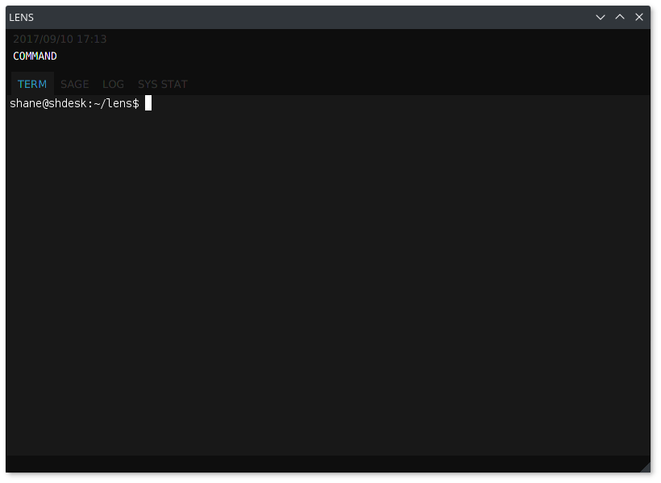
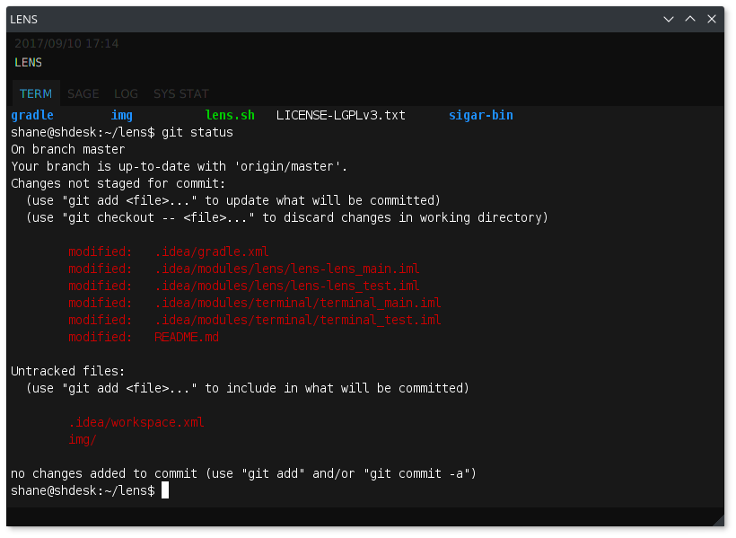

Lens
=====
Lens is an Emacs inspired process manager, with an embedded terminal emulator. The mission of Lens is to provide a central hub that can be easily focused (with a global keyboard shortcut) and is controlled entirely by a combination of predefined and user defined text commands. Lens is still in early development and there are still many improvements to be made to the inline tab system and process manager. Eventually the goal is to track launched processes to close/focus/manipulate them. The tabs other than 'TERM' must also be implemented with their own focus keys.

Commands
-----

There are four main types of commands that can be run through the lens command field:
* **predefined**
Built in commands that are required to run and configure the application (for ex. the predefined 'EXIT' command closes the application).
* **run**
Executes the specified executable with optional launch arguments.
* **shell**
Executes a user defined shell statement.
* **group**
One command that executes a group of other commands.

Run
-----

Run the main Lens application through the included gradle wrapper (./gradlew run).

Build
-----

Gradle is used to build this project. The project consists of 2 sub-projects:
* **lens**
The core application and utility code. Main app implemented in JavaFX and ReactFX with integrated Swing components.
* **terminal**
A modified version of the jediterm core terminal library. A Swing terminal emulator used in many JetBrains IDEs.

Authors
-----
Shane Hickman <srhickman@edu.uwaterloo.ca> Software Engineering student at the University of Waterloo.

Terminal
-----

The terminal emulator used in Lens is a modified version of JediTerm (https://github.com/JetBrains/jediterm), a terminal emulator designed for use in JetBrains IDEs. The core terminal, written in Swing, was modified to meet the needs of Lens in the following ways:
* Removed Swing tab and action implementation in favour of a separate JavaFX implementation.
* Removed colour settings in favour of themes matching the rest of the application.
* Removed Widget & Panel layout style in favour of a simpler LensTerminal object with no UI (for controlling the terminal) and the Terminal Panel encasing all necessary UI components for embedding the terminal in a JavaFX SwingNode.

The initial version of the JediTerm was a reworked terminal emulator Gritty, which was in it's own turn a reworked JCTerm 
terminal implementation. Now there is nothing in the source code left from Gritty and JCTerm. Everything was 
rewritten from scratch. A lot of new features were added.

Character sets designation and mapping implementation is based on
respective classes from jVT220 (https://github.com/jawi/jVT220, Apache 2.0 licensed) by J.W. Janssen.

Licenses
-----
All sources in the repository are licensed under LGPLv3, except for one root of the JediTerm core library, which is Apache 2.0 licensed:
* terminal/src/com/jediterm/terminal/emulator/*
